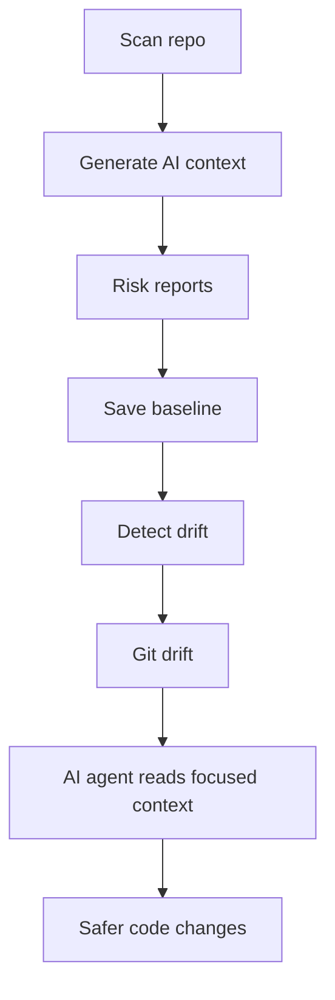

# ForgeLens

<p align="center">
  
</p>

<p align="center"><strong>AI coding workflow tracking for safer AI-assisted code changes.</strong></p>
<p align="center">ForgeLens maps your repo, tracks drift, and generates AI-ready context before coding agents edit your project.</p>

<p align="center">
  <a href="https://www.npmjs.com/package/forgelens"></a>
  
  
  
  
  
  
  
  
  
</p>

## Why ForgeLens?

AI coding agents often start in the wrong files. That creates slow edits, wasted context, and risky changes.

Common problems:
- Agents miss auth boundaries and session rules.
- Agents skip database/schema risk and server action risk.
- Agents ignore route exposure and env/config risk.
- Project rules drift over time, while old context is still used.

ForgeLens solves this with a local-first workflow:
- Scan the repo and generate compact AI-ready context.
- Highlight risky files and boundaries first.
- Save a baseline snapshot.
- Detect drift between baseline and current reports.
- Compare drift across git refs with `main..HEAD`.

## Quick Start

```bash
npx forgelens scan
npx forgelens quick --root . --out .forgelens
npx forgelens snapshot save --name current
npx forgelens compare --from current --out .forgelens
npx forgelens compare --git main..HEAD --out .forgelens
```

## What ForgeLens Generates

```text
AI_COMPACT_CONTEXT.md
AI_FOCUS_MAP.md
FORGE_CONTEXT.md
ARCHITECTURE_MAP.md
ROUTES_MAP.md
DATABASE_MAP.md
SERVER_ACTIONS_MAP.md
SECURITY_RULES.md
ENV_REPORT.md
RISK_REPORT.md
DRIFT_REPORT.md
REPO_REPORT.json
```

## Workflow Map



## Works With

ForgeLens is usable with Codex, Claude Code, Cursor, Copilot, Gemini CLI, OpenCode, and other AI coding agents.

## Install

Quick run:

```bash
npx forgelens scan
```

Global install:

```bash
npm install -g forgelens
forgelens scan
```

Local development:

```bash
pnpm install
pnpm build
pnpm link --global
forgelens scan
```

## CLI Commands

```bash
forgelens scan
forgelens quick
forgelens ux
forgelens check
forgelens snapshot save --name main
forgelens compare --from latest --out .forgelens
forgelens clear --yes
forgelens prompt
```

Legacy aliases still work:

```bash
forgelens ui-ux        # same as: forgelens ux
forgelens doctor       # same as: forgelens check
forgelens baseline     # same as: forgelens snapshot
forgelens drift        # same as: forgelens compare
forgelens clean        # same as: forgelens clear
forgelens prompt codex # legacy prompt alias
```

## Easy PNPM Commands

Use these when developing locally:

```bash
pnpm ui
pnpm quick
pnpm health
pnpm save
pnpm diff
pnpm clean
pnpm context
```

Very short aliases are also available:

```bash
pnpm s    # scan
pnpm u    # ux
pnpm ck   # check
pnpm qk   # quick
pnpm cl   # clear
pnpm sn   # snapshot save
pnpm cmp  # compare
pnpm pp   # prompt
```

Optional shell aliases:

```bash
source ./scripts/shell-aliases.sh
```

## Sample Output

```text
$ forgelens scan --format all
ForgeLens scan complete: /path/to/repo/.forgelens
- FORGE_CONTEXT: /path/to/repo/.forgelens/FORGE_CONTEXT.md
- ROUTES_MAP: /path/to/repo/.forgelens/ROUTES_MAP.md
- DATABASE_MAP: /path/to/repo/.forgelens/DATABASE_MAP.md
- SECURITY_RULES: /path/to/repo/.forgelens/SECURITY_RULES.md
- ENV_REPORT: /path/to/repo/.forgelens/ENV_REPORT.md
- UI_UX_REPORT: /path/to/repo/.forgelens/UI_UX_REPORT.md
- PERFORMANCE_RISK_REPORT: /path/to/repo/.forgelens/PERFORMANCE_RISK_REPORT.md
- REPO_REPORT_JSON: /path/to/repo/.forgelens/REPO_REPORT.json
```

## Developer Shortcuts

```text
make help           Show all shortcuts
make ui             Generate UI/UX report
make health         Run safety/readiness check
make save           Save current snapshot as baseline
make diff           Compare latest scan with baseline
make clean          Remove generated output folder
make context        Print Codex context prompt
make quick          Fast flow: health + ui
make hard           Full flow: scan + save + diff
make release-check  Run all release checks
```

## Docs

- Live product/docs website: [forgelens-lyart.vercel.app](https://forgelens-lyart.vercel.app)
- v0.3 roadmap: [docs/V0_3_ROADMAP.md](docs/V0_3_ROADMAP.md)
- GitHub launch checklist: [docs/GITHUB_LAUNCH_CHECKLIST.md](docs/GITHUB_LAUNCH_CHECKLIST.md)
- Contributing guide: [CONTRIBUTING.md](CONTRIBUTING.md)
- Security policy: [SECURITY.md](SECURITY.md)

## Safety Notes

- Scan and doctor do not modify source files.
- ForgeLens writes only inside the selected output folder (default `.forgelens/`).
- Env report includes file names and key names only, never secret values.
- Detection is static and deterministic; no runtime code execution.
- Security and auth findings are heuristic signals, not guarantees.

## Limits

- This is static analysis, not a full semantic or runtime analyzer.
- It is not a replacement for security review or penetration testing.
- No warning does not mean safe. False negatives and false positives are possible.
- Do not use ForgeLens as a security scanner or compliance gate.
