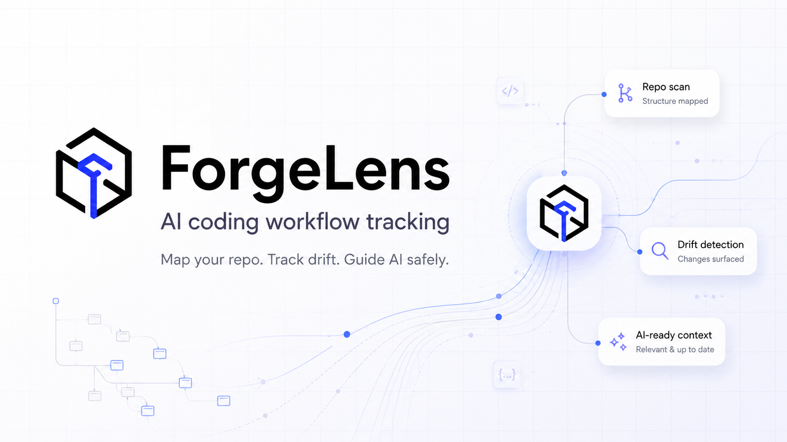
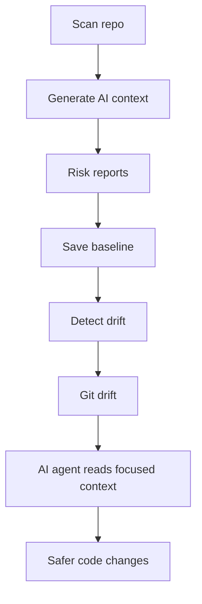

# ForgeLens

<p align="center">
  
</p>

<p align="center"><strong>AI coding workflow tracking for safer AI-assisted code changes.</strong></p>
<p align="center">ForgeLens maps your repo, tracks drift, and generates AI-ready context before coding agents edit your project.</p>

<p align="center">
  <a href="https://www.npmjs.com/package/forgelens"></a>
  
  
  
  
  
  
  
  
  
  
</p>

## Why ForgeLens?

AI coding agents often start in the wrong files. That creates slow edits, wasted context, and risky changes.

Common problems:
- Agents miss auth boundaries and session rules.
- Agents skip database/schema risk and server action risk.
- Agents ignore route exposure and env/config risk.
- Project rules drift over time, while old context is still used.

ForgeLens solves this with a local-first workflow:
- Scan the repo and generate compact AI-ready context.
- Highlight risky files and boundaries first.
- Save a baseline snapshot.
- Detect drift between baseline and current reports.
- Compare drift across git refs with `main..HEAD`.

## Quick Start

```bash
npx forgelens scan
npx forgelens baseline save --name current
npx forgelens drift --from current
npx forgelens drift --git main..HEAD
```

## What ForgeLens Generates

```text
AI_COMPACT_CONTEXT.md
AI_FOCUS_MAP.md
FORGE_CONTEXT.md
ARCHITECTURE_MAP.md
ROUTES_MAP.md
DATABASE_MAP.md
SERVER_ACTIONS_MAP.md
SECURITY_RULES.md
ENV_REPORT.md
RISK_REPORT.md
DRIFT_REPORT.md
REPO_REPORT.json
```

## Workflow Map



## Works With

ForgeLens is built for Codex, Claude Code, Cursor, Copilot, Gemini CLI, OpenCode, and other AI coding agents.

## Install

Quick run:

```bash
npx forgelens scan
```

Global install:

```bash
npm install -g forgelens
forgelens scan
```

Local development:

```bash
pnpm install
pnpm build
pnpm link --global
forgelens scan
```

## CLI Commands

```bash
forgelens scan
forgelens doctor
forgelens baseline save
forgelens drift
forgelens clean --yes
forgelens prompt codex
```

## Developer Shortcuts

```text
make check          Run typecheck, tests, build, and diff check
make scan           Generate ForgeLens reports
make baseline       Save current ForgeLens baseline
make drift          Compare against saved baseline
make site           Build Astro site
make release-check  Run all release checks
```

## Docs

- Astro product/docs app: [site/](site/)
- Docs entry page source: [site/src/pages/docs/index.astro](site/src/pages/docs/index.astro)
- MDX docs content: [site/src/content/docs/](site/src/content/docs/)
- GitHub launch checklist: [docs/GITHUB_LAUNCH_CHECKLIST.md](docs/GITHUB_LAUNCH_CHECKLIST.md)

Run docs locally:

```bash
pnpm site:dev
```

Then open `http://127.0.0.1:4321/docs`.

## Safety Notes

- Scan and doctor do not modify source files.
- ForgeLens writes only inside the selected output folder (default `.forgelens/`).
- Env report includes file names and key names only, never secret values.
- Detection is static and deterministic; no runtime code execution.

## Limits

- This is static analysis, not a full semantic or runtime analyzer.
- It is not a replacement for security review or penetration testing.
